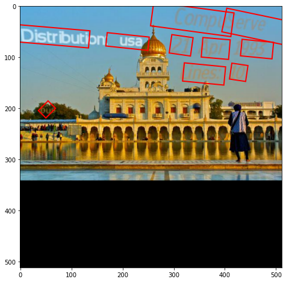
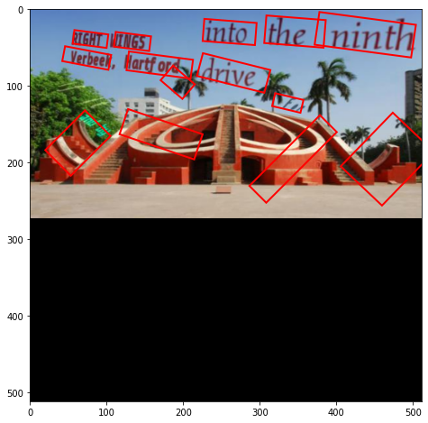
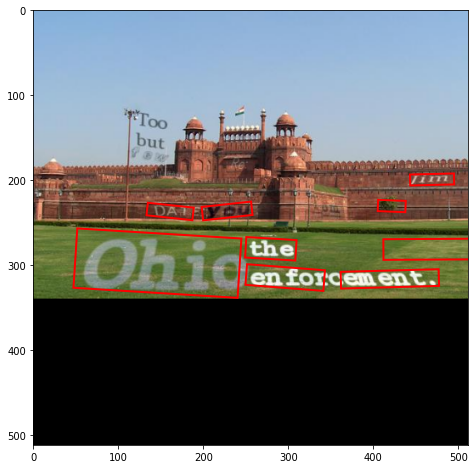

# Fast Oriented Text Spotting with a Unified Network (FOTS)

This repository is an unofficial PyTorch implementation of [FOTS Paper](https://arxiv.org/pdf/1801.01671.pdf). Here is the FOTS model architecture.


There are couple of existing PyTorch implementations which have very slow training process because data preprocessing/ground truth generation part is CPU boud and GPU keeps waiting for batch of data. But using this repo, preprocessing can be done separately (on CPU) and then the preprocessed data can be used to train the model which improves the training speed significantly (and GPU time can be saved).

There are currently **TWO separate branches** in this repository:

  1. **detection**: which only implements text detection. This branch is fully tested and works as expected.
  2. **recognition**: which implements both text detection and recognition, which is basically end to end FOTS. This branch is currently under development.

Detection branch was trained on a very small subset (10K images) of  [SynthText](https://www.robots.ox.ac.uk/~vgg/data/scenetext/) dataset for 25 epochs because of hardware limitations. Here are a few results from detection branch:

<p float="left">
  
  
  
  
</p>

These results can be easily improved further by trained on entire 800K images and then finetuned on [ICDAR-2015](https://rrc.cvc.uab.es/?ch=4&com=downloads) images.

## Requirements

To install dependencies:

```setup
pip install -r requirements.txt
```

## Training

To train the model on SynthText dataset, first run the preprocessing script:

```setup
python FOTS-PyTorch/preprocess.py -c config.json
```
The sample config files with all the available options are given in the `config/` dir.

After all the data is preprocessed, run the following comman to start training:

```setup
python FOTS-PyTorch/train.py -c train_config.json
```
Hyperparameters used for training are available in the training configuration file under `config/` dir.

## Evaluation

To evaluate the trained model on any image:

```setup
python FOTS-PyTorch/eval.py -m "<model_path>" -i "<input_dir>" -o "<output_dir>"
```

For more information, check the demo notebooks available under `notebooks/` dir.

TODO:

- [x] Implement Detection Branch 
- [ ] Implement Recognition Branch
- [ ] Validate both Detection and Recognition Branch
- [ ] Full training on SynthText Dataset
- [ ] Combine "detection" and "recognition" branches and make training mode configurable

## References:

- https://arxiv.org/pdf/1801.01671.pdf
- https://arxiv.org/pdf/1704.03155.pdf
- https://github.com/jiangxiluning/FOTS.PyTorch
- https://github.com/argman/EAST
